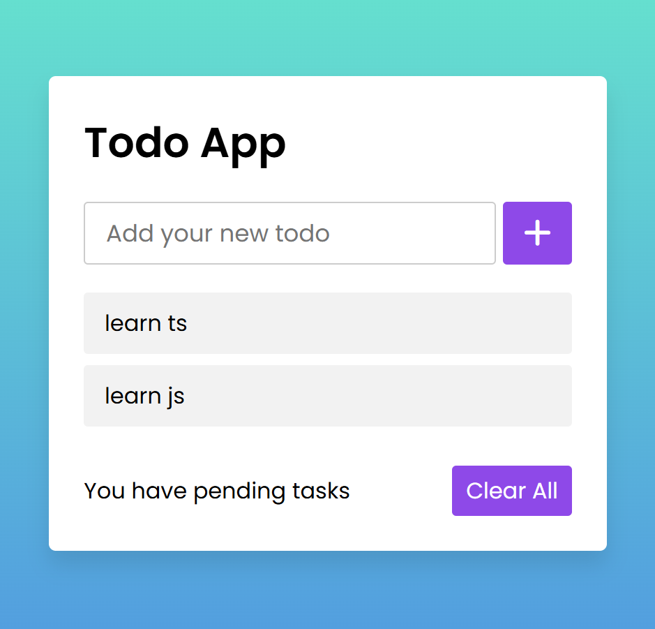

# 📝 TypeScript Todo List App

A modern and simple Todo List application built with **TypeScript, HTML, and CSS**.
This project demonstrates DOM manipulation, state management, and LocalStorage usage without any frameworks.

---

## 🚀 Live Demo

👉 Live Preview: **[Your Vercel Link Here]**

---

## 📸 Preview



---

## ✨ Features

* ➕ Add new todos
* ✔️ Mark todos as completed / uncompleted
* 🗑️ Delete todos
* 🧹 Clear all todos
* ⌨️ Add todo using **Enter key**
* 💾 Persistent data with `localStorage`
* 🎨 Smooth UI animations and modern design

---

## 🛠️ Built With

* TypeScript
* HTML5
* CSS3
* LocalStorage API
* Crypto API (`crypto.randomUUID()`)

---

## 📂 Project Structure

```
project/
│
├── index.html
├── style.css
├── dist/
│   └── app.js
├── src/
│   └── app.ts
└── README.md
```

---

## ⚙️ How It Works

### ➕ Add Todo

Each todo is created with a unique ID:

```ts
{
  id: crypto.randomUUID(),
  title: string,
  isCompleted: false
}
```

---

### ✔️ Toggle Todo

Click on a todo to mark it as completed or active.

---

### 🗑️ Delete Todo

Click the trash icon to remove a todo from:

* UI
* State
* LocalStorage

---

### 💾 Local Storage

All todos are stored in browser storage:

```ts
localStorage.setItem("todos", JSON.stringify(todos));
```

Data persists after page reload.

---

## 🌐 Deployment (Vercel)

---

## 👨‍💻 Author

Made with ❤️ while learning TypeScript

* GitHub: **[https://github.com/MuhammadRoshani]**

---

## 📄 License

This project is open source and free to use.
